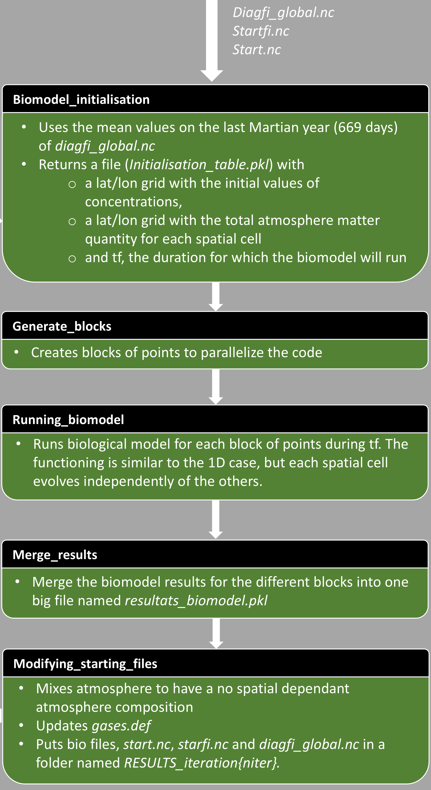

# Biomodel Directory – All Required Files for Biology

This directory contains all the necessary files for the biology component.  
It is **ABSOLUTELY INSEPARABLE** from the rest of the files of [Coupling_on_serve](../Coupling_on_server) section.

---

## Table of Contents

1. [Biological Scripts](#1-biological-scripts)  
2. [Data Grids](#2-data-grids)  
3. [Physics Support Files](#3-physics-support-files)  
4. [Server Scripts for Biology](#4-server-scripts-for-biology)  
5. [Ocean Freeze Test](#5-ocean-freeze-test)  
6. [Job Cleanup](#6-job-cleanup)

---

## 1. Biological Scripts

Files:
- `Acetogens1.py`
- `Bio.py`
- `Bio_model.py`
- `Bio_model_parameter`
- `Constants_GCM.py`
- `Functions.py`
- `Methanogens.py`

**DO NOT MODIFY THESE FILES.**

---

## 2. Data Grids

- `Grid_no_header.csv`: Used for CH₄ and H₂ fluxes in the atmosphere.  
- `Grid_values_ini.csv`: Interpolated to provide initial concentrations for cells and methanogens in the ocean.

**DO NOT CHANGE ANYTHING.**

---

## 3. Physics Support Files

### 3.1. `Physical_functions_GCM.py`

Calculates atmospheric matter quantity based on pressure and temperature profiles.

**DO NOT MODIFY UNLESS NECESSARY.**

---

### 3.2. `Main_evolution_function_RK.py`

Contains `system_evolution_RK` function which evolves atmospheric and oceanic composition under biological processes.

Uses an **adaptive LSODA** solver

**DO NOT MODIFY UNLESS NECESSARY.**

---

### 3.3. `Photochem.py`

Interpolates `Grid_no_header.csv` to return CH₄ and H₂ fluxes. Based on Zahnle & Kasting.

**DO NOT MODIFY UNLESS NECESSARY.**

---

### 3.4. `Interface_atmosphere_ocean.py`

Calculates interface fluxes using the stagnant boundary layer model (Karecha et al. 2005).

**DO NOT MODIFY UNLESS NECESSARY.**

---

## 4. Server Scripts for Biology

The way these files are organized is explain by the diagram below.



### 4.1. `Biomodel_initialisation.py` and `Biomodel_initialisation.sbatch`

Creates: `Initialisation_table.pkl` which contains : 
- a 2D spatial grid of initial concentrations
- Global atmospheric quantities grid
- `tf`: time for evolution (until CH₄ threshold reached)

`tf` is calculated as follows: the spatial cell with the highest initial number of cells evolves until it reaches the CH₄ threshold in the atmosphere defined by 
the `list_fG.txt` file (see the README.md in the Coupling_on_server section). `tf` is the time it takes for this cell to reach that threshold.


**Paths to edit in Python:**

```python
# Defining paths
diagfi_path = "/home/users/m/meyerfra/earlymars_test_couplage_global/"
gases_path = "/home/users/m/meyerfra/earlymars_test_couplage_global/"
initialisation_path = "/home/users/m/meyerfra/earlymars_test_couplage_global/Biomodel/"
```

Launched on server by `Biomodel_initialisation.sbatch`

**Path to edit in SBATCH:**

```bash
cd /home/users/m/meyerfra/earlymars_test_couplage_global/Biomodel
```

---

### 4.2. `generate_points_blocks.py` and `generate_blocks.sbatch`

- `generate_points_blocks.py`: generates 50 oceanic point blocks for parallel computation  
 **Nothing to change**

- `generate_blocks.sbatch`: launches the script  
**Line to update:**

```bash
cd /home/users/m/meyerfra/earlymars_test_couplage_global/Biomodel
```

---

### 4.3. `Running_biomodel.py` and `lancer_bio_para.sbatch`

- Evolves each oceanic point block biologically  
- Outputs: temporal evolution of ocean and atmosphere compositions

**Paths to edit:**

```python
# === PATHS ===
diagfi_path = "/home/users/m/meyerfra/earlymars_test_couplage_global/"
gases_path = "/home/users/m/meyerfra/earlymars_test_couplage_global/"
initialisation_path = "/home/users/m/meyerfra/earlymars_test_couplage_global/Biomodel/"
partition_path = "/home/users/m/meyerfra/earlymars_test_couplage_global/Biomodel/"
```

To reduce data resolution, you can modify this block by adding `[::step]` at the end of arrays :

```python
results[(i, j)] = {
    "t": t[::step],
    "Atmo": Atmo[::step],
    "Medium": Medium[::step],
    "Bio": Bio[::step],
    "Pression": Pression[::step],
    "timep": flux_times[::step]
}
```
`lancer_bio_para.tot` is used to launch this code 50 times in parallel on the server (corresponding to the 50 blocks of points generated).

**SBATCH path to update:**

```bash
cd /home/users/m/meyerfra/earlymars_test_couplage_global/Biomodel
```

---

### 4.4. `merge_results.py` and `merge.sbatch`

- Merges previously generated files into a single file: `resultats_biomodel.pkl`  
 **Nothing to change**

**SBATCH path to update:**

```bash
cd /home/users/m/meyerfra/earlymars_test_couplage_global/Biomodel
```

---

### 4.5. `Modifying_starting_files.py` and `modify_files.sbatch`

Prepares for GCM launch after biological coupling:
- Homogenizes atmospheric composition
- Updates `gases.def`
- Moves files to `RESULTS_iteration{iteration}` folder

**Paths to modify:**

```python
# Paths
diagfi_path = "/home/users/m/meyerfra/earlymars_test_couplage_global/"
initialisation_path = "/home/users/m/meyerfra/earlymars_test_couplage_global/Biomodel/"
biomodel_path = "/home/users/m/meyerfra/earlymars_test_couplage_global/Biomodel/"
gases_path = "/home/users/m/meyerfra/earlymars_test_couplage_global/"
start_path = "/home/users/m/meyerfra/earlymars_test_couplage_global/"
new_folder_path = "/home/users/m/meyerfra/earlymars_test_couplage_global/"
results_xx_path = "/home/users/m/meyerfra/earlymars_test_couplage_global/Biomodel/"
```

**SBATCH path to update:**

```bash
cd /home/users/m/meyerfra/earlymars_test_couplage_global/Biomodel
```

---

### 4.6. `lancer_bio_tot.sbatch`

Runs the biological model on the server.

**Command to launch:**

```bash
sbatch lancer_bio_tot.sbatch –fG threshold_CH4 –niter numero_iteration
```

- `threshold_CH4`: CH₄ limit for the biological model (float)  
- `numero_iteration`: current iteration number (int)

**SBATCH path to update:**

```bash
cd /home/users/m/meyerfra/earlymars_test_couplage_global/Biomodel
```

> 🟢 This script is optional for the full coupling but useful for testing biology code independently of the GCM.

---

## 5. `Test_end.py` and `test_end.sbatch`

- Checks if the ocean is entirely frozen. If true, the coupling is stopped.
- Generates `diagfi_global.nc` by concatenating GCM iterations
- Deletes redundant `start.nc` and `startfi.nc` files

**Paths to modify:**

```python
diagfi_path = "/home/users/m/meyerfra/earlymars_test_couplage_global/"
start_path = "/home/users/m/meyerfra/earlymars_test_couplage_global/"
```

**SBATCH path to update:**

```bash
cd /home/users/m/meyerfra/earlymars_test_couplage_global/Biomodel
```

---

## 6. `Cancel_unrunnable_jobs.sh`

This executable script deletes all jobs with unsatisfied dependencies at the end of the coupling process.  
It helps clean the job queue on the server (maintains a clean working environment on the cluster).

---
