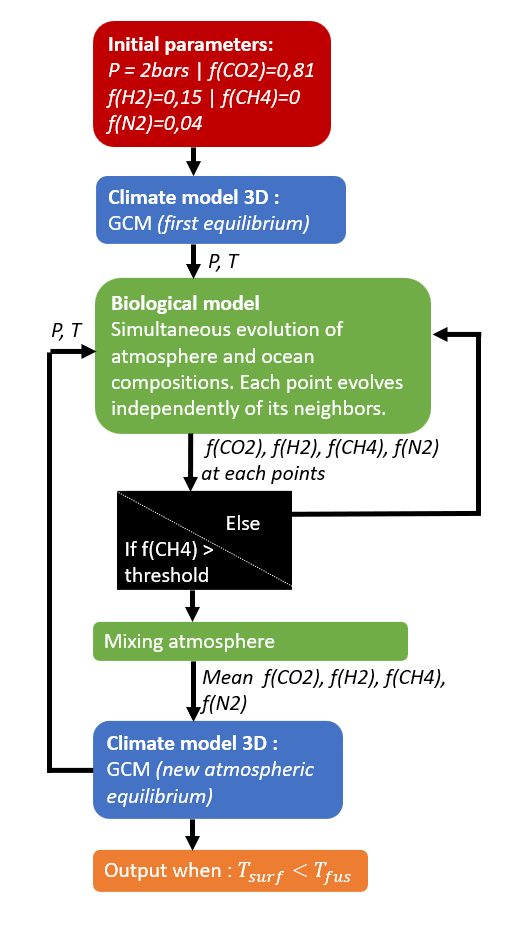

# 3D Bio-Climatic Coupling

This GitHub repository contains all the necessary files to simulate the coupling between biology and climate in the case of methanogens located in a hypothetical Martian ocean at the end of the Noachian period. The coupling is performed here in a three-dimensional case. The biological model is based on Sauterey et al. (2022), and the 3D climate model used is the Generic Planetary Climate Model *LMDZ* (to learn more about it, please see [documentation](https://lmdz-forge.lmd.jussieu.fr/mediawiki/Planets/index.php/Main_Page)). It will hereinafter be referred to as *GCM*.

## 1. General Principle of the Coupling
The initial prebiotic state of Mars is based on a scenario studied by Turbet and Forget (2021), to which N₂ has been added (see the red box in the diagram). The prebiotic equilibrium is calculated using the *GCM*.

Methanogenic cells are then introduced, and the system is allowed to evolve under the influence of biology. The concentrations of H₂, CH₄, CO₂, and N₂ in the ocean, the concentration of methanogens in the ocean, and the gas ratios in the atmosphere all evolve simultaneously. Each spatial point evolves independently from the others. Once a threshold of CH₄ is reached in the atmosphere, the climate equilibrium is recalculated to stay close to reality, and this process continues. The coupling stops when the model's ocean temperature falls below the ocean’s freezing point for each ocean spatial points. At this point, the ocean is considered frozen and biological activity ceases (see diagram).

## 2. Description of the Different Folders in This Repository
Four folders are included in this repository. Each of them contains a `README.md` file that provides more detailed explanations of the different codes and files in the folder.

- **Ktables**: Contains the correlated-k tables useful for an atmosphere composed of CH₄, CO₂, N₂, and H₂.
- **ciatables**: Contains the CIA tables necessary for the chemical species present in the atmosphere.
- **Coupling_on_server**: Contains all the code needed to run the coupling on a server, to parallelize it, etc.
- **Local_coupling_computation**: Contains everything required to run the coupling locally on your own computer.
- **Bibliography**: Contains the main articles on which this study is based, as well as the M1 internship report by François-Xavier Meyer.

*For more information, you can contact François-Xavier Meyer: [francois-xavier.meyer@ens-paris-saclay.fr](mailto:francois-xavier.meyer@ens-paris-saclay.fr)*
